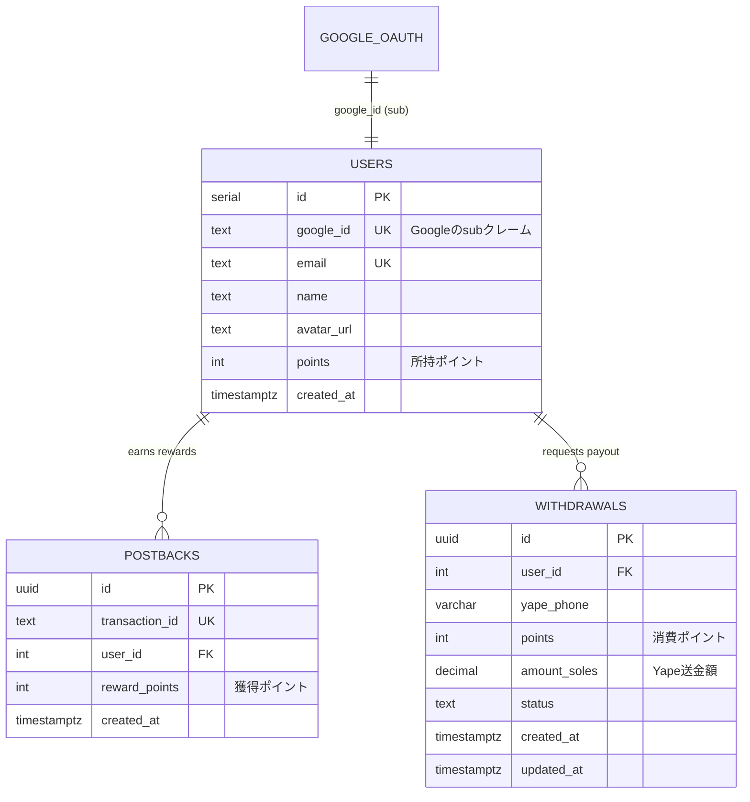

# データ構造・DBスキーマ

タスク一覧・タスク詳細・外部サイト誘導・成果判定はオファーウォールに任せるため、自アプリ側でタスク（案件）のマスタテーブルは持たない。案件データは都度APIから取得して表示するだけで保存しない。DBは**Heroku Postgres**。

現金額は保持せず、**整数ポイント**で管理する（100 pts = S/ 1（1pt = 1céntimo）。規約対応、[04-decisions.md](./04-decisions.md)参照）。

| テーブル | 役割 | 主な利用画面・処理 |
| --- | --- | --- |
| `users` | ユーザー情報と所持ポイントを管理する | Home / Wallet |
| `postbacks` | オファーウォールから届いた成果履歴（獲得ポイント数・承認状態）を保存する（`(provider, transaction_id)` で二重付与を防止） | Webhook / Wallet履歴 |
| `postback_logs` | ポストバックの生ペイロードを検証結果つきで残す監査ログ | 障害調査（DBクライアント） |
| `withdrawals` | Yape換金申請（消費ポイント＋支払ソル額）と送金ステータス（pending/completed/rejected）を管理する | Wallet / DBクライアント（管理者） |
| `topups` | Reloadly経由の携帯キャリアチャージ交換 | Wallet / 交換画面 |
| `complaints` | Indecopi 苦情記録簿 | Libro de Reclamaciones |
| `campaign_settings` | 事前登録キャンペーンの枠数・報酬・交換の開放日・招待の設定（**常に1行**、id=1） | /admin/campaign |
| `referrals` | 招待の1件。招待元と招待先を1対1で結ぶ（`invitee_user_id` はUNIQUE） | Home（招待カード） |

### キャンペーン設定を環境変数に置かない理由

枠数（100→200に増やす想定）、報酬、交換の開放日（リリースがずれれば動く）は
**キャンペーン中に変わる**。環境変数だと変更のたびに Heroku の設定変更と再起動が要り、
運用中に何度も触るには重い。DBに1行持ち、管理画面から変えて即座に反映させる。

変更は `admin_logs` に before/after 付きで残す（金の出入りに効く設定のため）。
開放日を空にすると全員が即座に交換できるので、その操作だけ確認を挟んでいる。

### 招待の成立条件は時期で変わる（二段階）

事前登録の期間中（交換が開くまで）は **招待された人が登録した時点**で成立させる。
ここで成立させないと、100人を集めたいまさにその期間に招待報酬が1件も出ず、
集客装置が集客したい時期に止まる。交換が開いた後は **電話番号の登録**に切り替える
（登録だけで報酬が出続けると「登録して使わない人」を招待する動機が残るため）。

当初案は「招待された側が3タスク完了で成立」だったが、その3タスクに
「友達を1人招待」が含まれており循環していた（AはBの3タスク完了待ち、Bのタスクには
Cの…と無限に遡る）。成立条件から招待自体を外して解消している。

自作自演を止めているのは `users.phone` のUNIQUE制約であって招待側のロジックではない。
報酬はポイントで即時に付くが、現金になるのは電話番号の登録を経た換金だけなので、
**金が出る前に必ず一意性の検査を通る**。キャンペーン本体と同じ考え方。

### オファーウォールの併存（provider）

MonlixとCPALeadのどちらを採用するか未確定のため、`postbacks.provider` で両方を並列に扱う。取引IDは提供元ごとの採番なので、冪等キーは `transaction_id` 単独ではなく **`(provider, transaction_id)` の複合UNIQUE**にしている。

成果は `pending` / `approved` / `rejected` の3状態で持つ。オファーウォールは「まず未承認で通知し、後日まとめて承認または否認する」流れを取るため、承認だけを扱うと否認・巻き戻し（[利用規約](../../web/app/terminos/page.tsx)にも条項あり）に対応できない。終端状態（approved / rejected）に達した成果への再通知は何もしない（二重付与とステータスの巻き戻り防止）。

> ⚠️ `postback_logs` は検証に失敗したリクエストも記録するため、いちばん行数が伸びる。Heroku Postgres Essential-0 は1万行上限なので、90日より古い行を定期削除するか Essential-1 へ移行する運用が必要（[02-tech-stack.md](./02-tech-stack.md)）。

## ER図

FarmMatchと同じく、`users.id` は連番の整数、Googleアカウントとの紐付けは `google_id` カラム（GoogleのIDトークンの `sub` クレーム）で行う。



## DDL（Heroku Postgres）

ポイントは整数（INT）で持つため計算ズレは発生しない。Yape送金額のみ `DECIMAL(10, 2)` を使う。フロントエンドはDBに直接アクセスしないため、RLSは不要（アクセス制御はFastAPI側で行う）。

```sql
CREATE TABLE users (
  id SERIAL PRIMARY KEY,
  google_id TEXT UNIQUE NOT NULL,                -- GoogleのIDトークンのsubクレーム
  email TEXT UNIQUE NOT NULL,
  name TEXT,                                     -- Googleの表示名
  avatar_url TEXT,                               -- Googleのアイコン画像URL
  points INTEGER NOT NULL DEFAULT 0,             -- 所持ポイント
  created_at TIMESTAMPTZ DEFAULT NOW()
);

CREATE TABLE postbacks (
  id UUID PRIMARY KEY DEFAULT gen_random_uuid(),
  provider TEXT NOT NULL DEFAULT 'monlix',       -- monlix / cpalead
  transaction_id TEXT NOT NULL,                  -- 提供元の取引ID
  user_id INTEGER NOT NULL REFERENCES users(id),
  reward_points INTEGER NOT NULL,                -- 獲得ポイント数（換算後）
  payout_usd DECIMAL(10, 4),                     -- 換算前の原資額（CPALeadはUSD建て）
  campaign_id TEXT,
  campaign_name TEXT,                            -- 履歴で「どの案件で得たか」を示す
  status TEXT NOT NULL DEFAULT 'pending' CHECK (
    status IN ('pending', 'approved', 'rejected')
  ),
  approved_at TIMESTAMPTZ,
  rejected_at TIMESTAMPTZ,
  created_at TIMESTAMPTZ DEFAULT NOW(),
  updated_at TIMESTAMPTZ DEFAULT NOW(),
  UNIQUE (provider, transaction_id)              -- 二重付与を防止
);

CREATE TABLE postback_logs (
  id UUID PRIMARY KEY DEFAULT gen_random_uuid(),
  provider TEXT NOT NULL,
  transaction_id TEXT,                           -- 生ペイロード由来のため任意
  http_method TEXT NOT NULL,                     -- GET / POST
  params JSON NOT NULL,                          -- クエリまたはボディの生JSON
  signature TEXT,                                -- 提供元が送ってきた署名（生値）
  verified BOOLEAN NOT NULL DEFAULT FALSE,       -- 署名検証の結果
  remote_ip TEXT NOT NULL,
  received_at TIMESTAMPTZ DEFAULT NOW()
);

CREATE TABLE withdrawals (
  id UUID PRIMARY KEY DEFAULT gen_random_uuid(),
  user_id INTEGER NOT NULL REFERENCES users(id),
  yape_phone VARCHAR(9) NOT NULL,                -- ペルーの電話番号（9桁）
  points INTEGER NOT NULL,                       -- 消費ポイント数
  amount_soles DECIMAL(10, 2) NOT NULL,          -- Yapeで送金する額(S/)
  status TEXT NOT NULL DEFAULT 'pending' CHECK (
    status IN ('pending', 'completed', 'rejected')
  ),
  created_at TIMESTAMPTZ DEFAULT NOW(),
  updated_at TIMESTAMPTZ DEFAULT NOW()
);
```

マイグレーションはFarmMatchと同じく**Alembic**で管理する（導入済み: `server/alembic/`）。スキーマの正はSQLModelモデル＋マイグレーションであり、上記DDLは参考情報。

## usersの行作成（プロビジョニング）

NextAuthでのGoogleログイン後、フロントエンドがGoogleのIDトークンを `POST /api/v1/auth/login` に送る。FastAPIがトークンを検証し、`sub` / `email` / `name` / `picture` を使って `users` 行をUPSERTしてから自前JWTを返す。詳細は [05-api-design.md](./05-api-design.md) を参照。

## Webhook / Postback処理フロー

```
オファーウォール（Monlix / CPALead）
  ↓ Postback / Webhook（GET または POST）
FastAPI (Heroku)
  ↓ ① 送信元IPの許可リスト検証   … 失敗ならログも残さず拒否
  ↓ ② 署名検証                    … 失敗なら verified=false でログを残して拒否
  ↓ ③ postback_logs に生ペイロードを保存
  ↓ ④ 報酬0なら正常終了（未付与）／上限超過なら遮断してログ
  ↓ ⑤ (provider, transaction_id) で成果を特定。終端状態なら何もしない
postbacks に保存／更新（pending / approved / rejected）
  ↓ 承認時のみ（同一トランザクション）
users.points を加算
  ↓
Home / Wallet にポイント反映（フロントはAPIから取得）
```

**報酬0は正常系**として扱う。「インストール後に初回起動」のような案件では、インストール時点で報酬0、初回起動時点で報酬ありと複数回に分かれて届く。エラー通知はせず、成果を作らずに正常応答する（生ログは残るので後追いはできる）。

**付与額の上限**（`MAX_REWARD_POINTS`）を設けている。報酬額はポストバックのペイロードをそのまま信じており、署名対象にも含まれず、サーバー側に期待額を持つ仕組みもない。上流のバグ・桁誤り・テストデータの本番混入による異常付与を遮断する防御層。

## 換金申請の運用フロー

1. ユーザーがWalletからYape番号・金額を入力して申請
2. FastAPIが**ポイントチェックと差し引きを1トランザクションで行い**、`withdrawals` に `pending` として保存（ポイントは申請時に差し引く。二重申請防止のため `pending` は同時に1件まで）
3. 管理者が **DBクライアント（TablePlus / pgAdmin等）** でHeroku Postgresに接続し `pending` を確認
4. Yapeで手動送金
5. `status` を `completed` に更新 → Wallet側の履歴表示が「送金完了」に変わる
6. 却下する場合は `rejected` に更新し、差し引いたポイントを `users.points` に手動SQLで戻す（詳細は [05-api-design.md](./05-api-design.md)）

## MVPで不要と判断されたもの

- `tasks` / `campaigns` / `task_details` テーブル
- タスク詳細画面 `/tasks/:taskId`
- 案件一覧API・案件詳細API
- 自作Admin画面（DBクライアントで代替）
- RLS（フロントエンドがDBに直接アクセスしないため）
